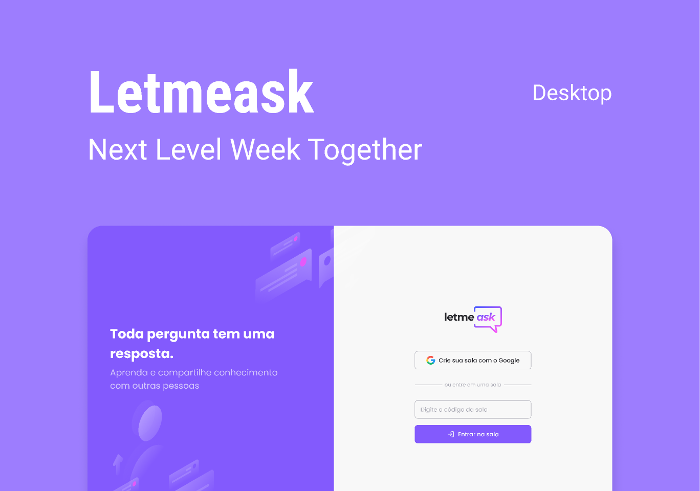

<div align="center">
  
  <br/><br/>
  
</div>

## 📃 About

**Letmeask** is perfect for content creators to create Q&A rooms with their audience in a very organized and democratic way. Developed during the **Next Level Week Together**, an online event produced by [**Rocketseat**](https://github.com/Rocketseat).

## 🖥 Tecnologies

<div>
  <br />
  <a href="#-tecnologias-utilizadas">
      
      
      
      
   </a>
</div>

This project was developed using cutting edge front-end technologies.

- [ReactJS](https://reactjs.org/)
- [Typescript](https://www.typescriptlang.org/)
- [Sass](https://sass-lang.com/)
- [Firebase](https://firebase.google.com/)

## 🚀 Getting started

### Requirements

- You need to install both [Node.js](https://nodejs.org/en/download/) and [Yarn](https://yarnpkg.com/) to run this project.

**Clone the project and access the folder**

```bash
$ git clone https://github.com/diegogasparcruz/letmeask.git && cd letmeask
```

**Follow the steps below**

```bash
# Install the dependencies
$ yarn

# Run the web server
$ yarn start
```

The app will be available for access on your browser at `http://localhost:3000`
